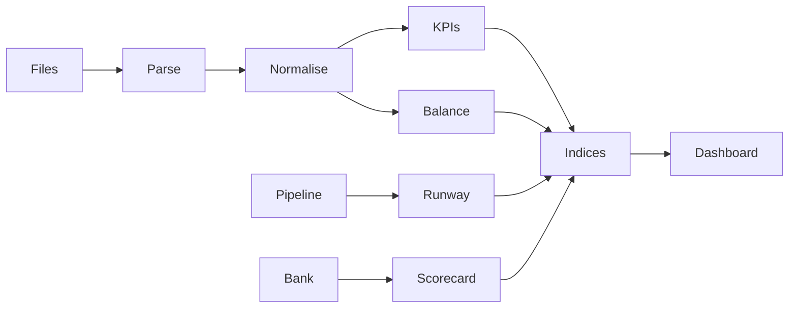

*งบดุลคือสัญญาณ · Balance sheet as signal, not spreadsheet. Hand-drawn studio still; no HUD on the image.*

# Ikigai Finance Engine

**SME finance intelligence — a research prototype that reads a company the way an operator reads a city dashboard.**

[What this is](#what-this-is) · [Philosophy](#philosophy) · [Ethical use](#ethical-use) · [How to use / learn](#how-to-use--learn) · [System diagram](#system-diagram) · [License](#license--contributing)

By [Non Arkaraprasertkul](https://github.com/Nonarkara) (Nonarkara) — [Axiom X Co., Ltd.](https://github.com/Nonarkara/Axiom), Bangkok.

Independent civic-studio work. Written for a **Thai–English** audience. **Personal / finance tooling — not financial advice.** This repository is not a bank, not a credit rating, and not a live product.

---

## What this is

A **research and education layer** for an SME finance-intelligence prototype. Cash runway first, balance-sheet structure second, bank standing third, composite indices last. The public tree is notes and a screenshot — enough to fork the *method*, not a deployable app.

What is actually in this repository:

- An anonymized dashboard screenshot — [`assets/screenshots/dashboard-overview.png`](assets/screenshots/dashboard-overview.png)
- Architecture notes and a mermaid data-flow — [`docs/ARCHITECTURE.md`](docs/ARCHITECTURE.md), [`assets/diagrams/system-overview.mmd`](assets/diagrams/system-overview.mmd)
- Research notes on runway arithmetic, bank scorecards, and five named indices — [`docs/RESEARCH.md`](docs/RESEARCH.md)

**ABC Company Limited** in the screenshot is fictitious. Figures are mockup data for interface design. The prototype chrome is bilingual (Thai / English, baht denomination). There is **no live public deployment** and **no application source code** in this tree.

Sibling software: **[Nonarkara/ikigai-finance](https://github.com/Nonarkara/ikigai-finance)** is a separate, runnable single-company cockpit (evidence inbox, local diagnostic, MIT). It is not this engine, and this repo is not a dump of that app.

**This repo is not:**

- Investment, credit, or tax advice
- Audited statements, a credit-rating agency, or a licensed advisory service
- A ranking of firms, founders, or banks
- API keys, `.env` files, client data, proprietary index weights, or deployment configs

---

## Philosophy

Studio tenets, applied to a finance desk:

**Fork the method, not the secrets.** Take the conservation laws, the panel grammar, and the rule that every index must say what it *cannot* say. Leave real ledgers, bank files, tokens, and unpublished weights on *your* machine. They do not belong in issues, screenshots, or pull requests.

**One Mac.** This prototype was designed as a single-operator surface — one desk, one company in view, no cluster. This public tree has no app to install; the method is the architecture and the research notes. Runnable studio software for one company lives in the sibling [ikigai-finance](https://github.com/Nonarkara/ikigai-finance) repo.

**No black-box rankings.** Runway is `cash / monthly net burn`. Assets must equal liabilities plus equity; if those stories disagree, the dashboard is supposed to make the disagreement visible. The five named indices (Ikigai, Lean, Zero, Default, Solvency) are **research constructs** on a 0–100 scale for operators — not regulatory ratings, not a league table of SMEs, and not published formulas. Weights are still under research and are **not** in this tree.

**Thai–English as the audience.** The studio writes for learners and operators who move between Thai and English. The screenshot’s chrome includes Thai (เครื่องยนต์การเงิน). This README is English with a Thai caption so a first glance is bilingual — not a claim that a localized product ships here.

Company: **Axiom X Co., Ltd.** Author: **Non Arkaraprasertkul** (Nonarkara). This is independent studio documentation, not a billed Axiom product and not an official depa, bank, or municipal system.

---

## Ethical use

Treat this as a **teaching prototype**, not a substitute for a licensed advisor, an auditor, or a bank’s own decision.

**Do**

- Read the screenshot as a stressed *interface* demo: 0.1 months of runway and negative equity are there to show distress UI, not to model a real client.
- Keep mock data mock. If you rebuild the surface, label synthetic figures as synthetic.
- Attribute the method when you fork the architecture or the research notes.
- Put any credentials you later add to *your* implementation in ignored env files — never in git.

**Do not**

- Present these indices, the bank scorecard, or a “suggested raise” as investment, lending, or credit advice.
- Treat a composite 0–100 score as a credit rating, a valuation, or a ranking of companies.
- Invent a live URL, a client roster, an award, or a published formula this tree does not contain.
- Commit API keys, bank statements, customer ledgers, `.env` files, or anything under NDA.
- Imply depa, a commercial bank, or a regulator publishes or certifies this prototype.

If a contribution only works by pasting a secret or a real company’s books, it does not belong here.

---

## How to use / learn

This tree is documentation. There is nothing to `npm install`.

1. Open the [anonymized screenshot](assets/screenshots/dashboard-overview.png). Note the banner: fictitious names, figures from a source dataset, not a live company.
2. Read [docs/ARCHITECTURE.md](docs/ARCHITECTURE.md) — balance sheet as signal, panel responsibilities, what the public repo omits.
3. Read [docs/RESEARCH.md](docs/RESEARCH.md) — runway arithmetic, bank scorecard intent, the five indices as lenses (not formulas), Thailand SME context, stated limitations.
4. Sketch the same conservation laws on paper for a company *you* own: `Assets = Liabilities + Equity`, `Cash(t+1) = Cash(t) + inflows − outflows`, `Runway = cash / burn`. If the three disagree, that disagreement is the lesson.
5. If you want **runnable** personal/company tooling, clone the sibling **[ikigai-finance](https://github.com/Nonarkara/ikigai-finance)** and follow its local playbook. Do not expect this engine repo to grow an app behind the screenshot.

Surface areas documented from the prototype (not implemented in this tree):

| Panel | Purpose |
| --- | --- |
| KPI strip | Cash, burn, runway, revenue, pipeline |
| Balance sheet | Assets vs liabilities + equity |
| Cash flow & runway | Outlook, cash-zero date, planning raise |
| Bank scorecard | Standing, benchmarks, risk flags |
| Finance indices | Five research scores, 0–100 |
| Macro sidebar | SET, USD/THB, gold — context only |

---

## System diagram

Short labels so GitHub’s renderer does not clip. Fuller graph: [`assets/diagrams/system-overview.mmd`](assets/diagrams/system-overview.mmd).

Source layer (private if you build one): balance sheet, cash flow, bank inputs, pipeline, macro feeds. This public repo stops at the diagram.

---

## License / contributing

[MIT](LICENSE). Copyright © 2026 **Non Arkaraprasertkul / Axiom X Co., Ltd.**

MIT covers this repository’s documentation, diagrams, and illustration. It does not relicense bank data, SET/FX feeds, or any private implementation that is not in this tree. The hero at `docs/hero-banner.jpg` is studio illustration for this README — not a screenshot and not a data product.

Useful contributions: clearer prose, a Thai README pass that stays faithful to these English notes, and mermaid that still fits GitHub. Open a pull request against `main`. Do not add secrets, client figures, invented metrics, fake live URLs, or application code that would imply this research repo is the production engine.

If you build your own operator surface from this method, the studio would like to see it.
