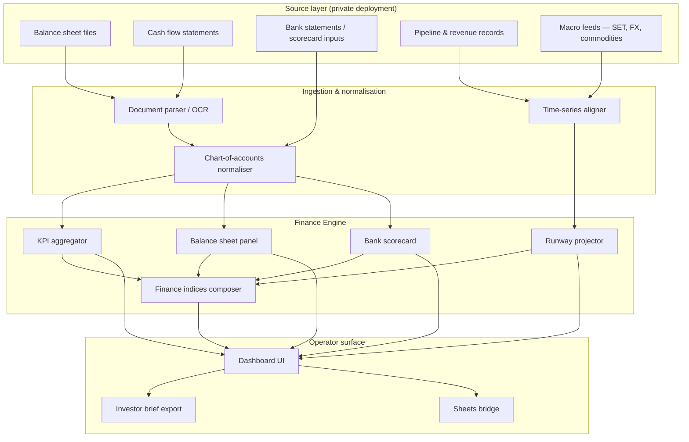

# Architecture — Ikigai Finance Engine

High-level system design for the finance intelligence prototype. This document describes **intent and data flow**, not proprietary implementation.

---

## Design principle

Treat the balance sheet as a **signal surface** — the same way a city dashboard treats traffic, air quality, and incidents as fused layers. Financial health is not one number; it is a **conservation law**:

```
Assets = Liabilities + Equity
Cash(t+1) = Cash(t) + Inflows − Outflows
Runway (months) = Cash / Burn
```

If these three relationships disagree, something in the narrative is wrong. The dashboard makes disagreement visible before it becomes a crisis.

---

## System overview



Source diagram file: [`../assets/diagrams/system-overview.mmd`](../assets/diagrams/system-overview.mmd)

---

## Panel responsibilities

### KPI strip
Rolling aggregation of cash, monthly burn, runway, recognised revenue, and weighted pipeline. Designed for **30-second reads** — the operator should not scroll to know if the month is survivable.

### Balance sheet panel
Horizontal bar + tabular breakdown. The bar answers *is it balanced?*; the tables answer *where is the imbalance?* Negative equity triggers visible risk flags downstream.

### Cash flow & runway
12-month cumulative cash projection from historical inflows/outflows and stated burn. Outputs **cash-zero date** and a **suggested raise** figure to reach a target runway (e.g. 12 months) — a decision aid, not a valuation.

### Bank scorecard
Traffic-light summary (green / amber / red) across credit standing, benchmark comparison, and explicit risk flags (e.g. negative equity, overdraft proximity). Compares operator position to sector benchmarks where available.

### Finance indices sidebar
Composite 0–100 scores with human-readable labels (LOW LEVERAGE, STRATEGIC, INDEFINITE, DEFAULT RISK, DISTRESS). Each index reads from a different subset of normalised inputs; see [`RESEARCH.md`](RESEARCH.md).

### Macro sidebar
External context only — SET index, USD/THB, gold. Not predictive; prevents the operator from reading cash runway in a vacuum.

---

## Deployment posture (current)

| Aspect | Status |
|--------|--------|
| Public URL | None — development stage |
| Data | Mock / anonymised demo only in public materials |
| Auth | Not documented here |
| Multi-tenant | Design target; not public |

Production deployments, if any, remain under client engagement and are **not represented in this repository**.

---

## What this repo omits

- Application source code
- Database schemas with real rows
- API endpoint definitions with live keys
- Exact index weighting formulas under active research

Those belong in private development environments. This repo is the **research and education layer** — enough to understand the problem, the architecture, and the interface intent.
